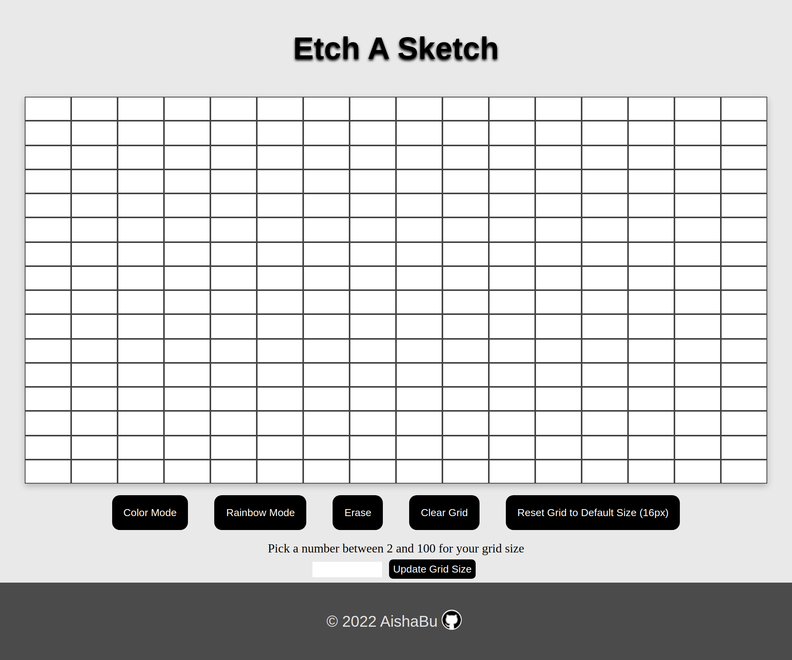
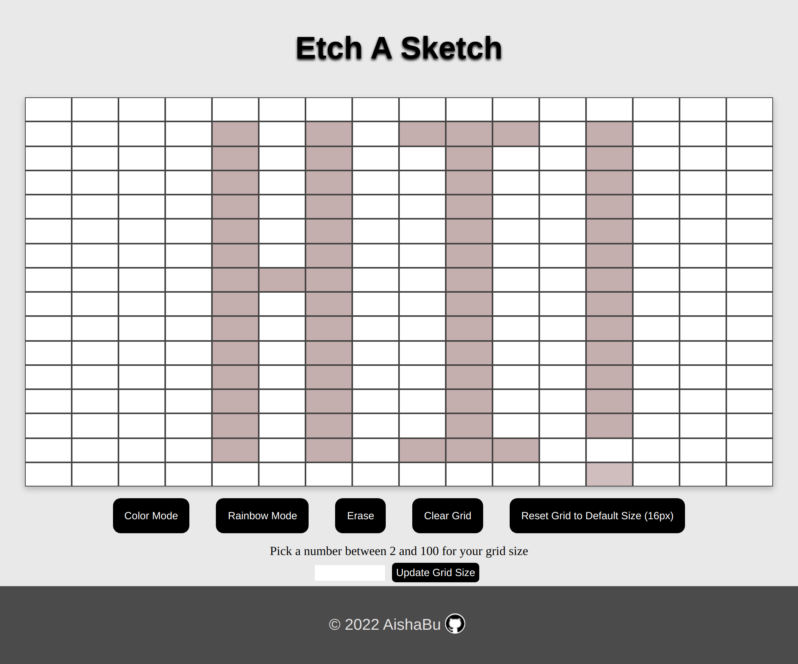
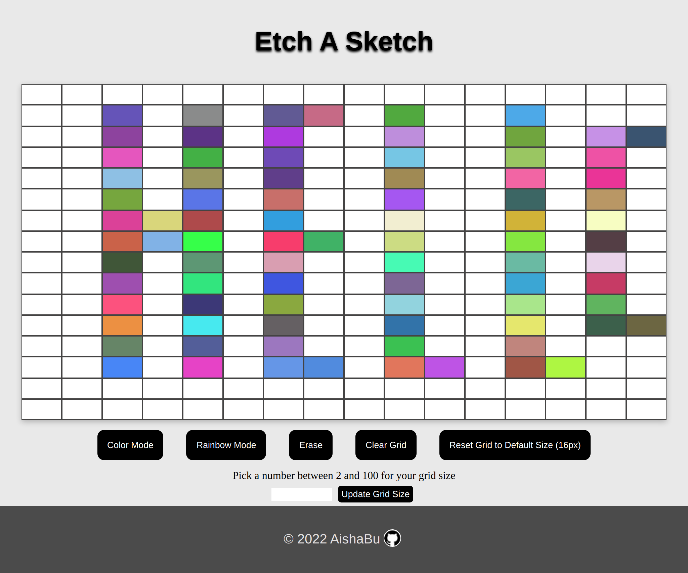
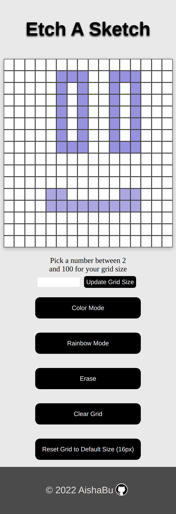
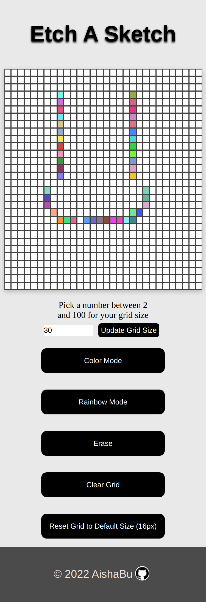
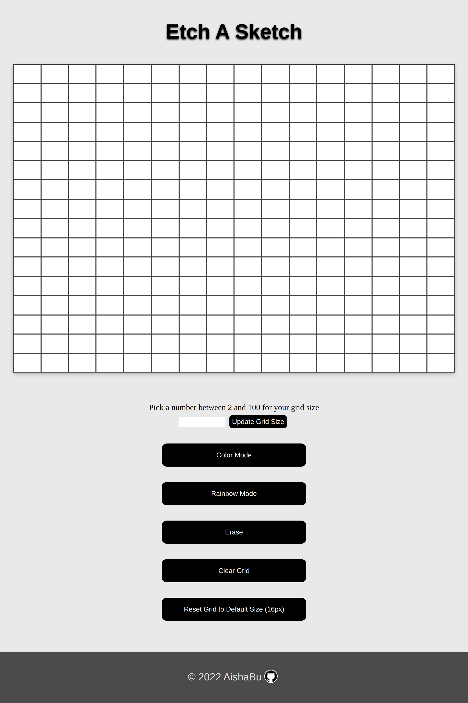

## Etch-A-Sketch Game

<table>
    <tr>
    <td></td>
    </tr>
</table>

### Description
This Etch-A-Sketch game was made for the Etch-A-Sketch assigment in the Odin Project. The assignment was to make an etch-a-sketch game using HTML, CSS, and JavaScript. The game is fully responsive for desktop, tablet and mobile devices. While creating this game, I practiced DOM manipulation using JavaScript to change the color of text, to create elements and attributes, and to recieve  user input values. I also learned how to use mouse events with event listeners to make the grid change colors when the user clicks each grid square, and to implement the user color choice. I also made more use of arrow functions, and learned to use embedded variables in string literals to make the user's number input appear on the grid. 

#### How To Play
<ol>
<li><b>To Activate Grid Color & Hover Effect: </b> Click once and move mouse in either direction to activate color.</li>
 
<li><b>To Pause Hover Effect: </b> While holding mouse button down, move mouse up or down,   wait for hands curser to appear, move the mouse without activating the hover effect.</li>
 
<li><b>To Erase: </b> Double click on square to erase.</li>
</ol>

#### Desktop Devices
<table>
    <tr><td></td></tr>
    <tr><td></td></tr>
</table>

#### Mobile Devices
<table>
    <tr>
    <td></td>
    <td></td>
     </tr>
</table>

#### Tablet Devices
<table>
    <tr><td></td></tr>
</table>

### Live Site
[Etch A Sketch Game]( https://aishabu.github.io/etch-a-sketch/)

### Built With 
HTML  
CSS 
JavaScript 

### Sources

#### Github Footer Icon 
<a href="https://www.flaticon.com/free-icons/github" title="github icons">Github icons created by Laisa Islam Ani - Flaticon</a>

#### Odin Project
[Odin Project - Etch A Sketch Project](https://www.theodinproject.com/lessons/foundations-etch-a-sketch)
